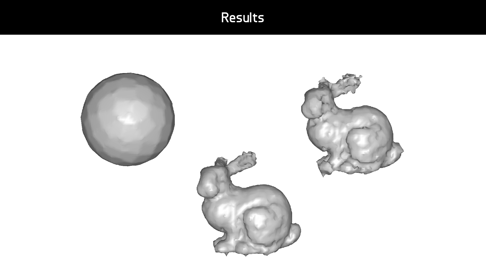
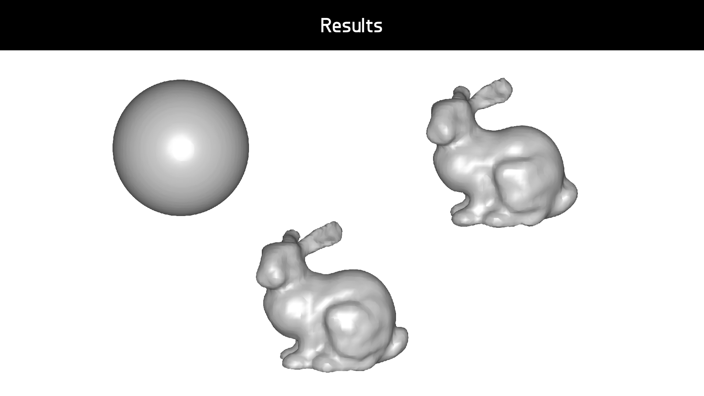

# Assignment #6
## Introduction
The aim of this exercise sheet is to make yourself familiar with surface reconstruction.
The provided template already outlines the reconstruction process; your task is to complete it by implementing a signed distance function for implicit surface reconstruction using two methods:
- Hoppe distance from tangent planes [Hoppe 92]
- Triharmonic Radial Basis Functions (RBFs)

## Dependencies
This assignment requires a few additional libraries including OpenMesh, OpenGL, and FreeGLUT, which are already installed in the second homework. If you haven't installed them on your machine, check [here](https://github.com/MBZUAI-Metaverse/CV804-starter-code/tree/main/assign2#installing-dependencies).

## Compiling Your Code and Run
To compile the code, use the following script:
```
mkdir build && cd build
cmake ..
make
```

After compiling the code, two folders `lib` and `bin` will be created in the top root of the project. In the `bin` folder, there are two excutable files `reconstruct` and `viewer`. `reconstruct` is for generating the mesh given the path of the cloud points:
```
./bin/reconstruct <input point cloud> <output mesh> <mode: HOPPE or RBF>
```
where `<input point cloud>` is the path to the cloud point (e.g. `data/bunny-500.pts`), `<output mesh>` is the save path of the generated mesh (e.g. `output_meshes/bunny-500.obj`), and mode is the method that you want to use, including implicit hoppe distance and implicit RBF.

You can visualize your generated mesh using the viewer:
```
./bin/viewer <output mesh> # visualization
```

Here is an example to run the full pipeline:
```
./bin/reconstruct ../data/bunny-500.pts ../bunny-500.obj HOPPE
./bin/viewer ../bunny-500.obj
```

## Tasks
In this assignment, you have to implement two implicit 3D surface reconstruction algorithms, including Hoope distance from tangent planes and Triharmonic Radial Basis Functions.
#### Task 6.1: Hoppe distance from tangent planes
- Your task is to complete the `ImplicitHoppe::operator()` function in `ImplicitHoppe.hh`
- Firstly, given an input point `_p`, you have to find the closest sample point
- After that, calculating the distance `dist` from point `_p` to closet tangent plane
- Return that calculated distance
- The results of this task should look like this


#### Task 6.2: Triharmonic Radial Basis Functions
- Your task is to complete the `ImplicitRBF::ImplicitRBF()` in `ImplicitRBF.hh`
- The kernel function is `ImplicitRBF::kernel(c_i, x)` in `ImplicitRBF.hh`. It will take two inputs: center `c_i` and point `x`, calculate the distance and return cube of that distance (Triharmonic RBFs, please check the instruction for more details).
- Your goal here is to form a correct matrices `M`, `weights_`, and `d` using on- and off- surface constraints.
- And then, using `solve_linear_system` function to calculate `weights_`.
- The calculated `weights_` will be used in `ImplicitRBF::operator()` to estimate the signed distance.
- The results of this task should look like this.


## Free Tips
- Please check the instruction for more details
- Generic Matrix Methods (gmm) library is provided to help you with solving linear equation (`solve_linear_system` function). You can define a `MxN` gmm matrix `A` with default value 0 by calling `gmmMatrix A(M, N);`. To define a vector `V` size `N`, you can call `gmmVector V(N, 100.0);`, the initualized values of all the element will be set to 100.
- The viewer used in this assignment is the same as the assignment 2, you can replace it with yours.
- When you call `solve_linear_system(M, b, x)`, it will solve the linear equation and modify the values in `x` directly

## We Value Creativity!
Try to find a way to make your homework distinguish. For example, you can add more features to the program, speed up the code, etc. We will give you some credit scores (up to 10%) if we think your program is intesting.
